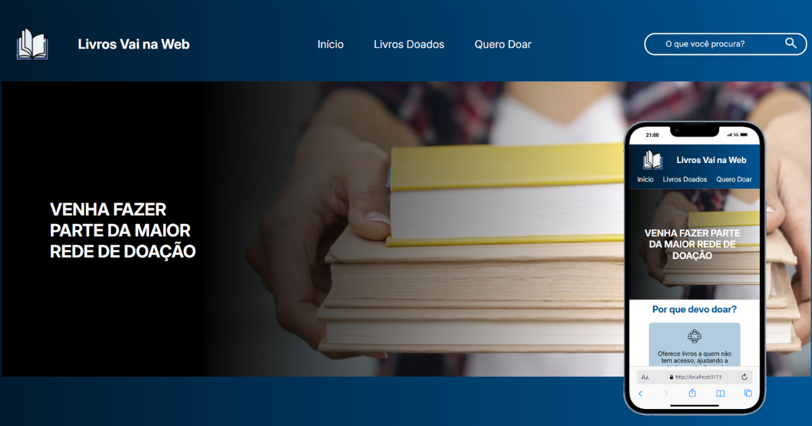
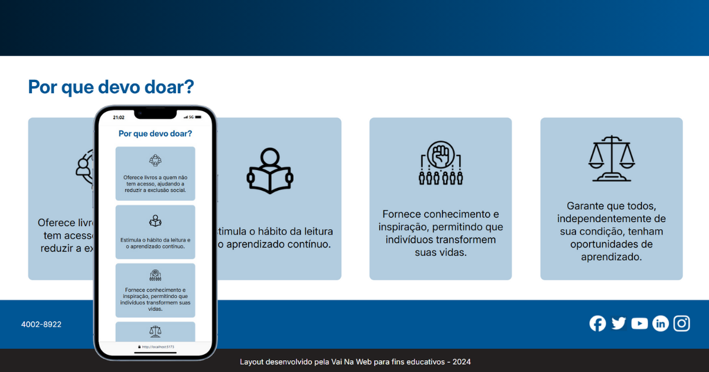
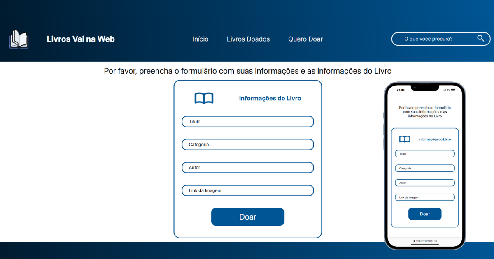
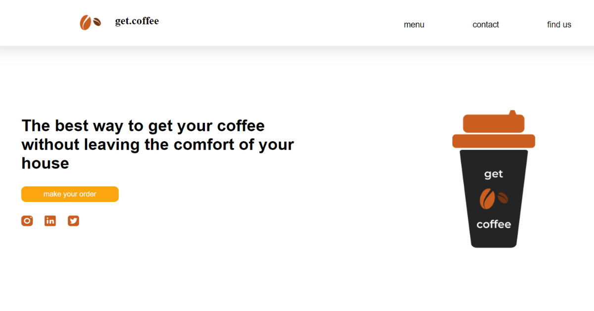
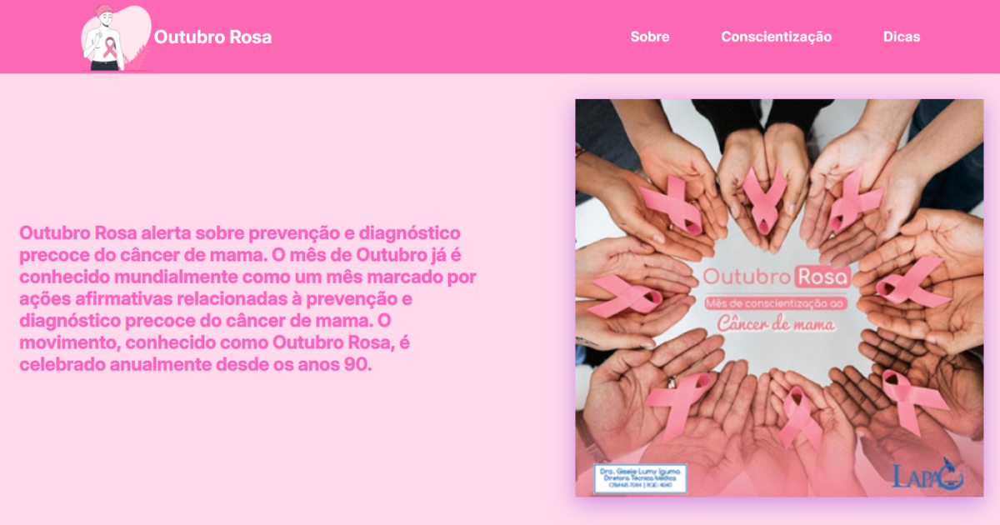
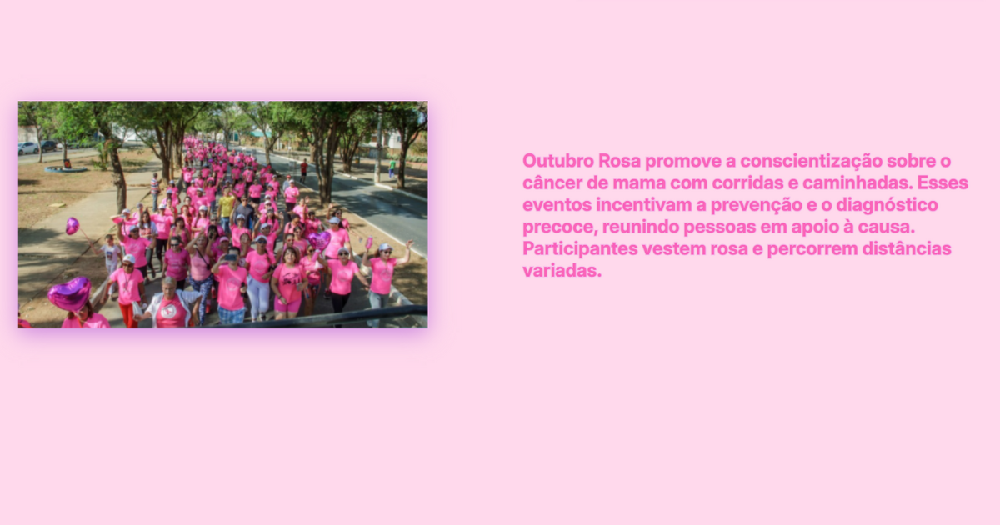
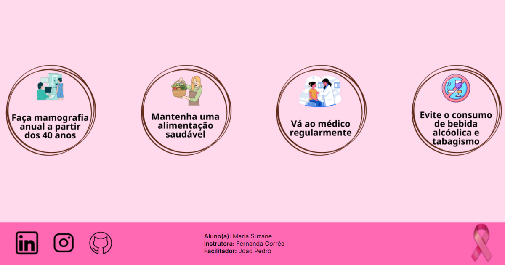
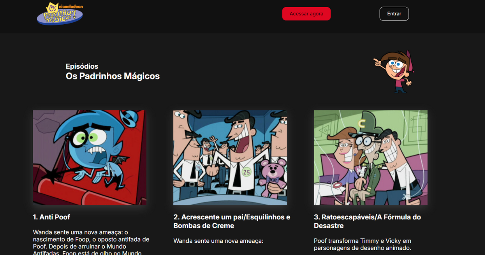

## Atividades e Projetos desenvolvidos nas aulas de Desenvolvimento FullStack pela Escola Vai na Web.

<h3> REACT:</h3>

- [DESAFIO FINAL](REACT/DESAFIO_FINAL_Mod-1/)

- link do deploy: https://escola-vai-na-web.vercel.app/

&nbsp;
&nbsp;

<h3> HTML e CSS:</h3>

- [Get Coffee](HTML_CSS/get_coffee/)

- [Outubro Rosa](HTML_CSS/outubro_rosa/)

 &nbsp;  &nbsp; 

- [Os Padrinhos Mágicos](HTML_CSS/padrinhos_magicos/)

